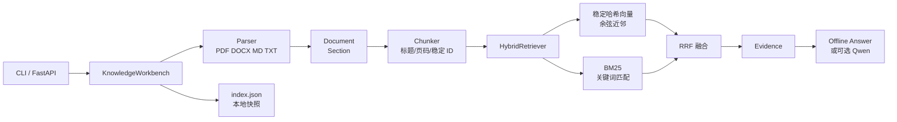

# KnowLedger 企业知识库检索工作台

KnowLedger 是一个面向学习、演示和面试作品集的知识库 RAG 工作台。它把“文档解析 → 结构化切分 → 混合检索 → 带来源回答”串成一条可以在本地复现的链路，并同时提供 CLI 和 FastAPI 入口。

项目默认运行在**无密钥、无外网、无 Milvus 服务**的离线模式。离线检索使用进程间稳定的哈希向量、轻量 BM25 和 RRF（Reciprocal Rank Fusion）融合排序，因此克隆仓库后即可运行；代码中另外保留了 OCR HTTP、Qwen 和 Milvus 的可选适配器边界，README 会明确区分“已实现”和“待接入”。

## 功能范围

- 原生解析 UTF-8 的 Markdown、纯文本和 DOCX；PDF 通过可选的 `pypdf` 解析。
- 解析结果保留文档 ID、章节、页码和 Chunk ID，问答响应返回可核查的来源字段。
- 稳定哈希向量 + BM25 + RRF 混合检索，不依赖模型 API Key。
- 文档入库、重复入库幂等、删除、索引重建、JSON 快照恢复。
- CLI：入库、查询、列文档、查看 Chunk、删除和重建。
- FastAPI：健康检查、文本/文件上传、文档列表、Chunk 观测、查询、删除和重建。
- 离线回答器输出证据摘要；显式切换到 `online` 且提供 DashScope Key 后才会尝试 Qwen。

## 架构



离线向量维度为 96，仅用于可复现的本地演示，不等同于生产 embedding。混合检索输出的每条 `Evidence` 同时包含向量分、BM25 分、融合分和排序名次。

## 快速开始（Windows PowerShell）

```powershell
py -3.10 -m venv .venv
.\.venv\Scripts\Activate.ps1
python -m pip install -U pip
python -m pip install -e ".[dev]"

# 使用仓库中的示例文档；数据默认写入 ./knowledger_data
$env:KNOWLEDGER_MODE = "offline"
python -m knowledger ingest examples/sample-handbook.md
python -m knowledger query "如何申请远程办公？"
python -m knowledger list
```

Linux/macOS 的激活命令为 `source .venv/bin/activate`。也可以不安装开发依赖，直接执行 `python -m pip install -e .`；PDF、在线回答和 Milvus 分别需要对应的可选 extra。

启动 HTTP 服务：

```powershell
$env:KNOWLEDGER_WORKSPACE = "./knowledger_data"
python -m uvicorn knowledger.api:app --host 127.0.0.1 --port 8010
```

服务只绑定 loopback，适合本机演示。启动后访问 `http://127.0.0.1:8010/docs` 查看 OpenAPI 页面。

## CLI 示例

```powershell
# 直接写入一段文本
python -m knowledger ingest-text policy.md "# 远程办公`n每周三可申请远程办公。"

# 查询并打印来源 JSON
python -m knowledger query "每周几可以远程办公？" --top-k 3

# 观察某个文档的 Chunk（document_id 来自 ingest 输出）
python -m knowledger chunks <document_id>
python -m knowledger delete <document_id>
python -m knowledger rebuild
```

PowerShell 中如果需要真正的换行，可使用 ``"# 标题`n正文"``；在脚本中建议直接读取文件后调用 `ingest`。

## HTTP API

| 方法 | 路径 | 作用 |
| --- | --- | --- |
| `GET` | `/health` | 返回模式、文档数和 Chunk 数 |
| `GET` | `/v1/documents` | 列出已入库文档及章节元数据 |
| `POST` | `/v1/documents/text` | JSON 入库：`{"filename":"guide.md","text":"..."}` |
| `POST` | `/v1/documents/upload` | multipart 文件入库，单文件上限 20 MiB |
| `GET` | `/v1/documents/{document_id}/chunks` | 查看指定文档的 Chunk |
| `DELETE` | `/v1/documents/{document_id}` | 删除文档及其内存索引 |
| `POST` | `/v1/index/rebuild` | 按当前切分配置重建内存索引 |
| `POST` | `/v1/query` | 预检索并生成带来源回答 |

文本入库和查询示例：

```powershell
$body = @{ filename = "handbook.md"; text = "# 报销`n差旅报销需在 30 天内提交。" } | ConvertTo-Json
$doc = Invoke-RestMethod -Method Post -Uri http://127.0.0.1:8010/v1/documents/text `
  -ContentType "application/json" -Body $body

$query = @{ query = "差旅报销期限是多少？"; top_k = 3 } | ConvertTo-Json
Invoke-RestMethod -Method Post -Uri http://127.0.0.1:8010/v1/query `
  -ContentType "application/json" -Body $query
```

`/v1/query` 返回形如：

```json
{
  "answer": "离线证据摘要 ...",
  "mode": "offline",
  "query": "差旅报销期限是多少？",
  "prefetch_count": 1,
  "sources": [
    {
      "chunk_id": "<stable-id>",
      "document_id": "<document-id>",
      "filename": "handbook.md",
      "section": "报销",
      "page": null,
      "vector_score": 0.71,
      "bm25_score": 1.03,
      "fused_score": 0.032
    }
  ]
}
```

分数是排序和调试信号，不应直接当作概率。要核查答案，请用 `chunk_id` 调用 Chunk 接口或打开原文。

## 配置

复制 `.env.example` 为 `.env`（不要提交真实密钥）：

| 变量 | 默认值 | 说明 |
| --- | --- | --- |
| `KNOWLEDGER_MODE` | `offline` | `offline` 或显式 `online` |
| `KNOWLEDGER_WORKSPACE` | `knowledger_data` | JSON 快照目录 |
| `KNOWLEDGER_TOP_K` | `5` | 默认召回数 |
| `KNOWLEDGER_CHUNK_SIZE` | `500` | Chunk 最大字符数（至少 32） |
| `KNOWLEDGER_CHUNK_OVERLAP` | `80` | Chunk 重叠字符数 |
| `KNOWLEDGER_LLM_MODEL` | `qwen-plus` | online 模式的模型名 |
| `DASHSCOPE_API_KEY` | 空 | 仅 online 模式使用，密钥来自环境变量 |
| `KNOWLEDGER_OCR_ENDPOINT` | 空 | 仅记录可选 OCR 地址，不会自动伪造 OCR 结果 |

## 可选能力边界

这些边界是有意保守设计的，便于面试时清楚说明完成度：

- **OCR**：`integrations/ocr_http.py` 只实现一个 HTTP 客户端协议。只有调用方显式把 `HttpOcrAdapter` 传给 `KnowledgeWorkbench(ocr=...)`，且 PDF 原生文本为空时才会请求；仓库不包含 OCR 引擎、凭据或离线 OCR 结果。
- **Milvus**：`integrations/milvus.py` 只负责延迟导入和连接参数校验。`add_chunks` 当前抛出 `NotImplementedError`，因为 embedding 维度、collection schema 和部署地址必须由实际环境决定。默认工作台仍使用内存检索，不能宣传为“已接入在线 Milvus”。
- **Qwen/DashScope**：只有 `KNOWLEDGER_MODE=online` 且 `DASHSCOPE_API_KEY` 非空时才尝试导入 `langchain-community` 的 ChatTongyi；依赖或请求失败会返回离线摘要并标记 `offline_fallback`。默认不联网。
- **解析格式**：当前稳定支持 PDF、DOCX、Markdown、TXT；CSV/Excel 等格式未在解析器中实现，不应在项目介绍里写成已支持。

## 数据、幂等和安全边界

- 文档 ID 由“文件名 + 内容”的 SHA-256 前 20 位生成。同一文件重复入库会先移除旧索引再写入，结果和 Chunk ID 稳定，不会无限增长。
- `index.json` 保存原文和章节元数据，属于本地演示快照；请按数据敏感等级自行加密、备份或清理。
- 没有用户认证、租户隔离、权限模型、审计服务、分布式并发控制或生产级限流。不要直接把默认服务暴露到公网。
- API 上传限制为 20 MiB；文件解析默认同样限制。文件名会规范化为 basename，避免把客户端路径写入快照。
- 离线模式不访问网络；OCR、在线模型和 Milvus 只有显式配置并由调用方接入时才会产生外部请求。

## 测试与质量检查

```powershell
python -m pip install -e ".[dev]"
python -m pytest
python -m ruff check src tests
```

测试覆盖解析（含最小 DOCX）、切分稳定性、BM25/向量/RRF 混合排序、重复入库幂等、快照恢复、来源字段和 FastAPI 端点。CI 在 Python 3.10/3.11/3.12 上重复安装并运行 pytest 与 Ruff；测试不需要任何密钥或在线服务。

## 适合写进简历的表述

**KnowLedger 企业知识库检索工作台（个人项目）**
技术栈：Python、FastAPI、Pydantic、BM25、RRF、Milvus（可选适配边界）、LangChain/Qwen（可选在线回答）

- 设计 `Document → Section → Chunk → Evidence` 数据链路，完成 PDF/DOCX/Markdown/TXT 解析、结构化切分及章节/页码来源保留，支持 CLI 与 FastAPI 双入口。
- 实现无密钥可复现的混合检索：稳定哈希向量近邻结合 BM25，并用 RRF 融合排序；查询结果返回 `chunk_id`、文件、章节、页码和多路分数，便于答案核查和调试。
- 实现本地 JSON 快照、重复入库幂等、删除与索引重建；将 OCR HTTP、Qwen 和 Milvus 抽象为显式可选适配器，明确离线默认能力与生产接入边界。

以上表述刻意没有把未实现的 OCR 引擎、在线 Milvus schema 或生产鉴权写成既成事实，可根据实际面试演示再补充数据指标。

## 目录

```text
src/knowledger/
  parsers.py       # PDF/DOCX/Markdown/TXT 解析
  chunking.py      # 保留章节和页码的切分
  retrieval.py     # 稳定向量 + BM25 + RRF
  answering.py     # 离线摘要与可选 Qwen
  workbench.py     # 入库、快照、查询和生命周期
  api.py           # FastAPI
  cli.py           # 命令行
  integrations/    # OCR/Milvus 可选边界
examples/          # 可直接导入的示例文档
tests/             # 离线单元和 API 测试
```

## License

MIT，见 [LICENSE](LICENSE)。
